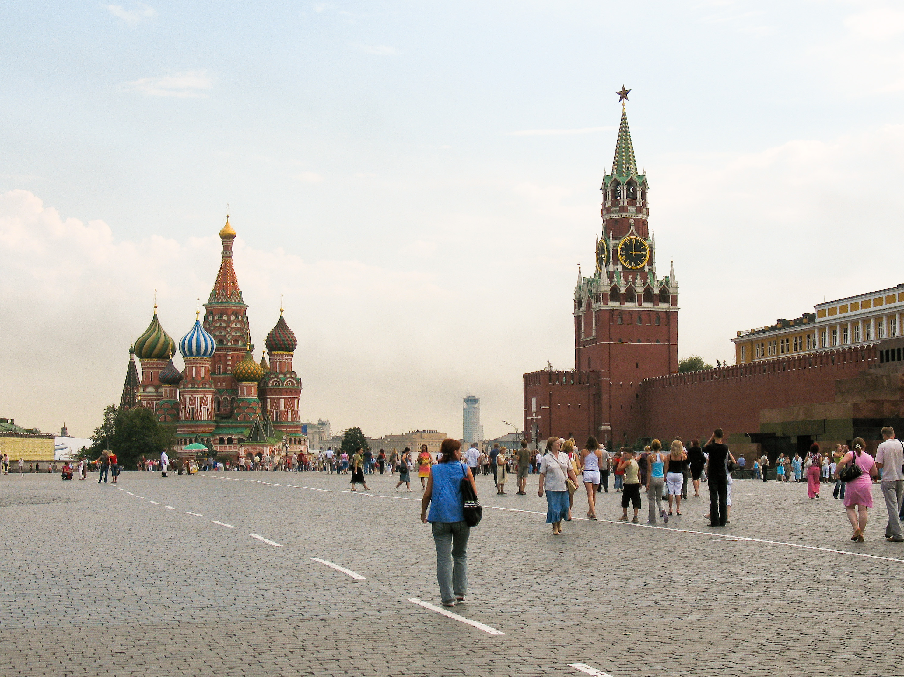
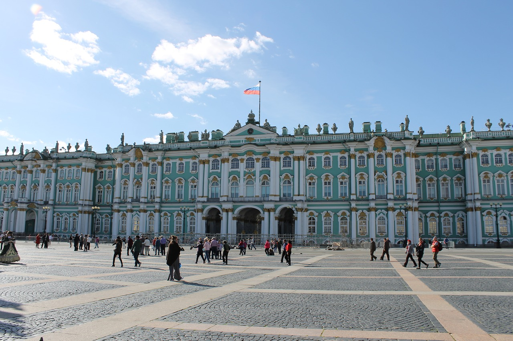
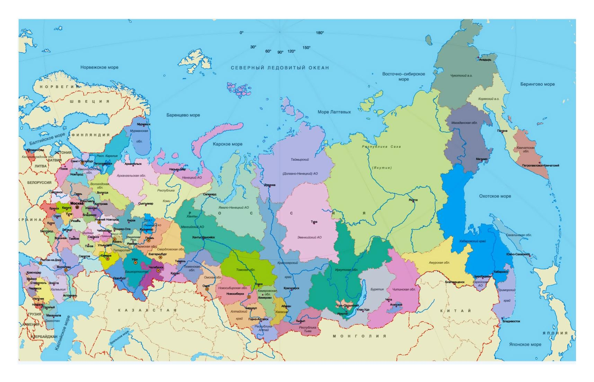

<h1>Welcome</h1>
<h2><b>Introduction</b></h2>

Hello! My name's Emma and this is my experimental website for course module <strong>SML5202</strong>.
  

Here are three facts about me:

  <ol>
  <li>I'm from Gloucestershire.</li>
  <li>I study Spanish and Russian.</li>
  <li>I enjoy art, reading and sport.</li>
</ol>
  

The language learning websites I use the most are <a href="https://context.reverso.net/translation/">Reverso Context</a> and <a href="https://www.wordreference.com/">WordReference</a>

 

 
 

 
 
 

<h2>Винни-Пух</h2>
<iframe width="420" height="315"
src="https://www.youtube.com/embed/bEwE4wyz00o">
</iframe>

<pre style="background-color:#dce3e8;">
Russian Winnie-the-Pooh (Винни-Пух) is 
quite different to his English counterpart.
</pre>

 

  

    

    
        

          
Moscow

        

    

  

  

    

        
        

          
St. Petersburg

        

      

  

  

    

        
        

          
A map of Russia

        

    

  

